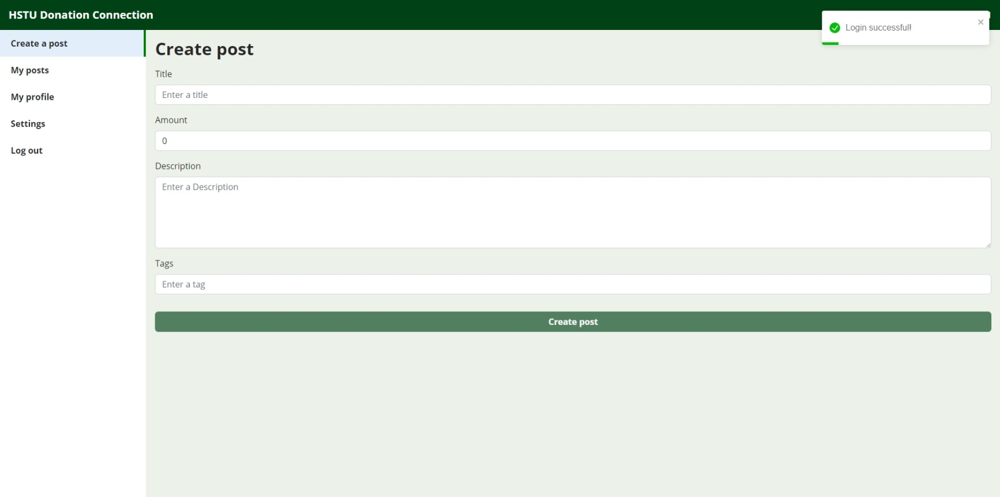

# Student Aid Frontend

Student Aid is a platform built using Node.js, Express.js, and React.js to assist financially disadvantaged students in fundraising for education. This repository contains the frontend codebase for the Student Aid application.



## Table of Contents

- [Features](#features)
- [Prerequisites](#prerequisites)
- [Getting Started](#getting-started)
- [Deployment](#deployment)
- [Contributing](#contributing)
- [License](#license)

## Features

- User-friendly interface for easy navigation and interaction.
- Secure authentication and authorization system.
- Profile management for users to update their information.
- Help post creation and management.
- Donation tracking and progress monitoring.
- Integration with a secure Payment Gateway using SSLCOMMERZ.

## Prerequisites

Before running the frontend application, ensure that you have the following prerequisites installed on your system:

- Node.js (version >= 12)
- NPM (version >= 6)

## Getting Started

To get started with the frontend application, follow these steps:

1. Clone the repository:

   ```bash
   git clone https://github.com/hr-sobuj/student-aid-frontend.git
   ```

2. Navigate to the project directory:

   ```bash
   cd student-aid-frontend
   ```

3. Install the dependencies:

   ```bash
   npm install
   ```

4. Configure the backend API endpoint:

   Open the `.env` file in the project root directory and set the `REACT_APP_API_URL` variable to the URL of your backend API.

5. Start the development server:

   ```bash
   npm start
   ```

6. Open your web browser and visit `http://localhost:3000` to access the Student Aid frontend application.

## Deployment

To deploy the frontend application to a production environment, follow the deployment instructions specific to your hosting platform. Make sure to set the appropriate environment variables for your production environment.

## Contributing

Contributions to the Student Aid frontend are welcome! If you find any issues or have suggestions for improvement, please open an issue or submit a pull request.

## Tools Used

The following tools and technologies were used in the development of the Student Aid frontend:

- React.js
- React Router
- Axios
- Tailwind CSS
- CSS
- HTML

## Testing

To test the application, use the following credentials:

- Email: user1@gmail.com
- Password: 123

Use the provided credentials to log in and test the various features and functionalities of the live chat application.

## License

This project is licensed under the [MIT License](LICENSE).
